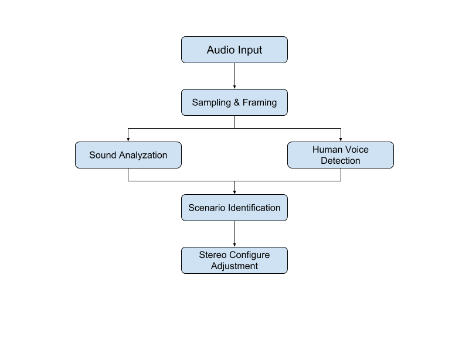
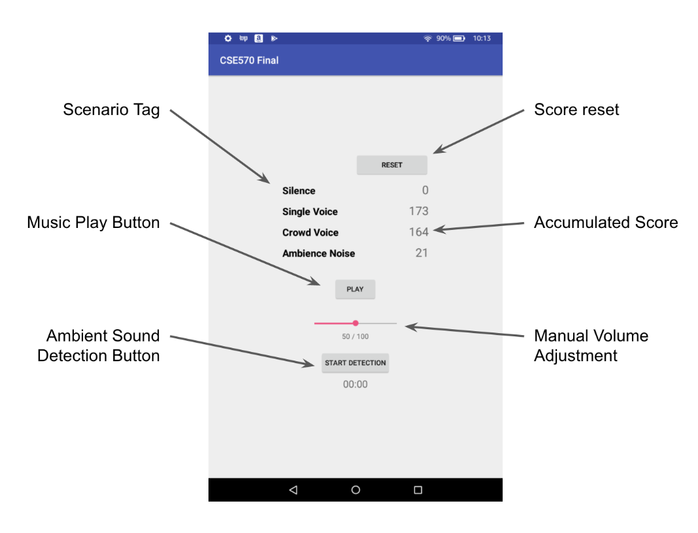
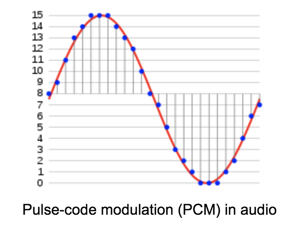

# Ambient-Voice-Recognition
## Workflow diagram and APP configure

<p align="center">
  
</p>

<p align="center">
  
</p>

Four labels — “silence”, “single voice”, “crowd voice”, and “ambient noise” are set to represent the four scenarios that are able to describe user’s most common environment. The difference among these four scenarios is basically upon the sound type, therefore the environment types (e.g. indoor or outdoor) is not taken into consideration. Some scenarios may be hard to be identified from others (e.g. crowd voice from single voice). Following are the detailed definition of four labels:
#### Silence
In default most quiet places are classified as the silence scenario.
#### Single Voice
This label is for the scenario where only one or two persons are talking around the user. Usually this happens in someplace like the user stays in the study room with friends or listens to a speech in the lecture hall.
#### Crowd Voice
This label is for the scenario where multiple human voices are occurring continuously around the user. Some cases like a shuttle full with people is a typical example for this scenario.
#### Ambient noise
This label is for the scenario where there is no human voice but a specific sound that almost never stops disturbing the user. A good example is the NCS commuter lounge room. The vendor machine over there periodically generate noise that is hard to ignore.

## Collect background sound data in Android devices
The Android media framework provides basic media services, including two major tasks in our app — collecting audio signals from devices’ audio source, usually from microphone, and playing various format media files as well. Here, our app use the AudioRecord APIs to collect background sound and use the MediaPlayer APIs to play music. Like a human being, the AudioRecord module is the ear of an app, which is used to hear surrounding voices from its microphone, and the MediaPlayer moulde is the mouth of an app, which sings a beautiful song.
Since we need to get the raw data of input audio signals for further analysis, we use the AudioRecord API, which manages the audio resources for Java applications to record audio from the audio input hardware of the platform. The collected audio data is encoded in PCM (Pulse-code modulation) format. From the PCM-encoded audio data, we can easily retrieve the amplitude and frequency of the sound.

<p align="center">
  
</p>

First of all, we need to acquire users permission before initializing the AudioRecord. We define the uses-permission in AndroidManifest.xml.
```
<user-permission android:name="android.permission.RECORD_AUDIO" />
```
When initializing, we need to setup parameters of the AudioRecord module, including:
##### Audio source: microphone
##### Sample Rate: 16000 Hz
##### Audio format: PCM 16 bits
For power consumption and system performance concern, we collect and analyze audio source about every 200 millisecond. The reason for choosing such a high frequency is due to the limitation of TensorFlow. If we choose longer duration, e.g. 1000 millisecond, the recognition result from TensorFlow model would be terrible. However, if we choose shorter duration, the recognition module would cost most of the system resource, thus making the system very lag. Also, power consumption is also an issue.

## Principle of Human Voice Detection
Please refer to https://www.tensorflow.org/versions/master/tutorials/audio_recognition

## Criteria of Scenario Identification
If sound average volume is lower than 40 dB, the scenario at the moment (< 0.2 sec) is regarded as silence environment.<br />
If sound cannot get enough score in the human voice detection but the volume is large enough, it is the environment with ambient noise.<br />
If TensorFlow model identifies that sound is full of human voice, and the volume never exceeds the 75dB and is closed to positive skewed distribution, it is regarded as single voice environment.<br />
If sound is full of human voice while the volume is negative skewed or normalized distribution, it is crowd voice environment.<br />
Each time the identification process continuously classifies the collected sound for 1 minutes, and after the time APP adjust the music volume in accordance of the output label. In terms of silence and single voice labels, the music would be turn down; while the crowd voice label would make it louder. The default label is ambience noise.
